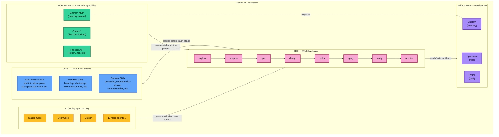
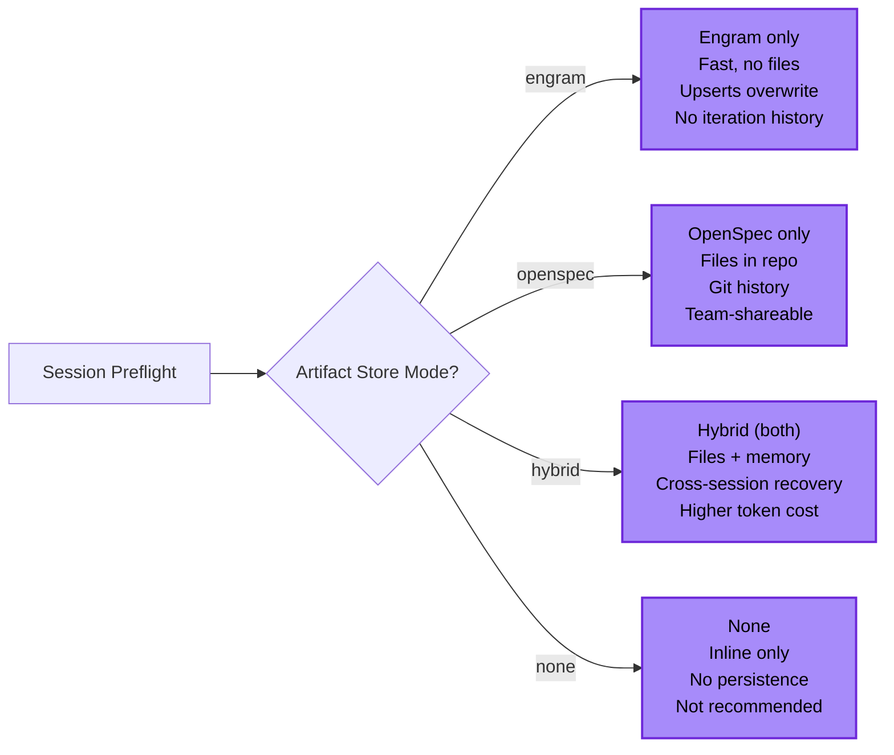
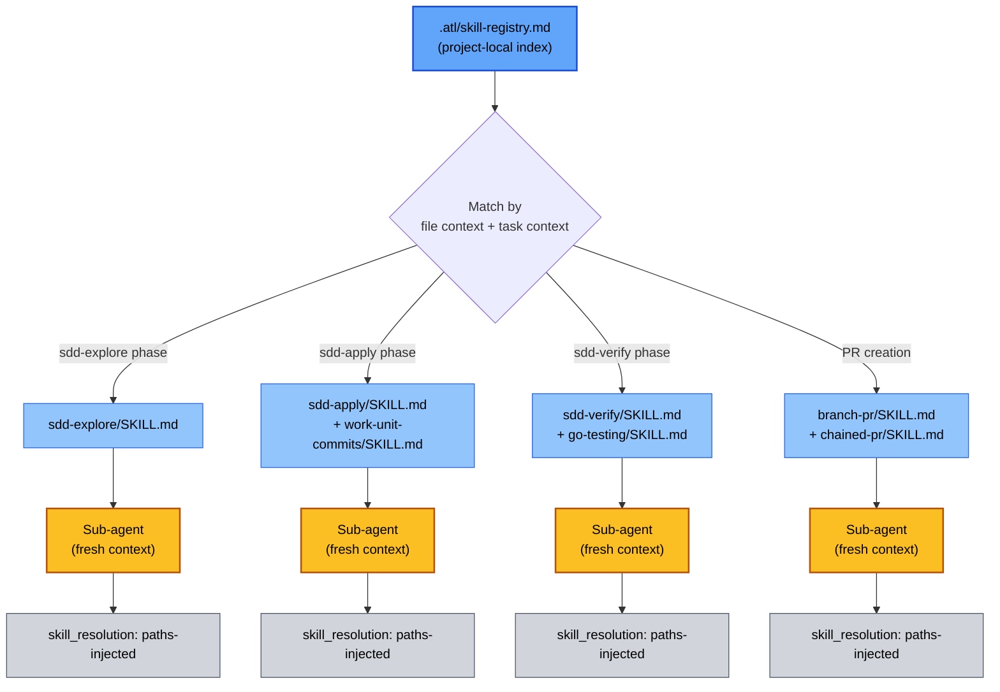
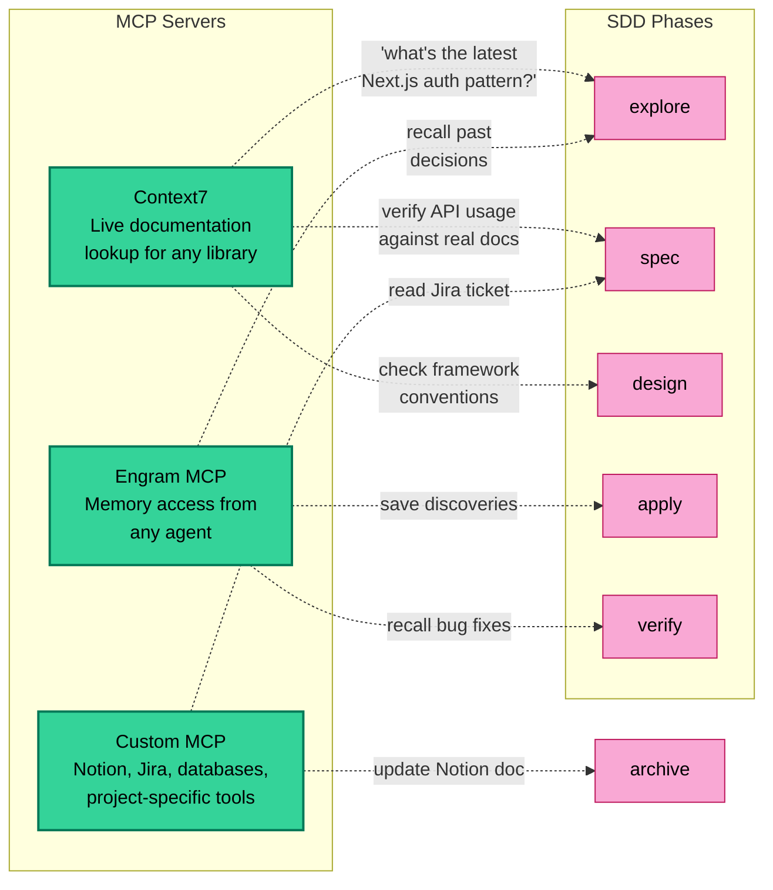
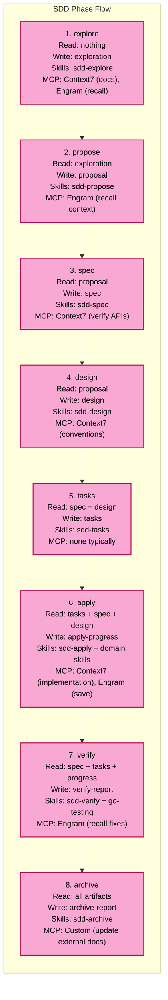
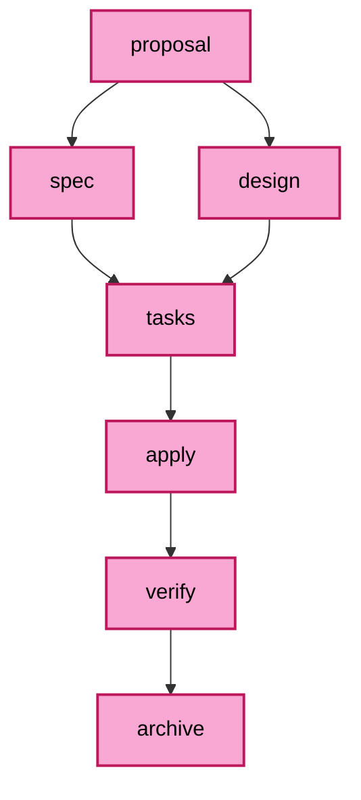

# SDD Ecosystem

← [Back to README](../README.md)

---

## Overview

Spec-Driven Development (SDD) is the workflow layer at the center of Gentle-AI. It does not operate in isolation. SDD orchestrates phases (explore → propose → spec → design → tasks → apply → verify → archive), and each phase leverages three supporting pillars:

| Pillar | Role | What it provides to SDD |
|--------|------|-------------------------|
| **Artifact Store** | Persistence | Where specs, designs, tasks, and reports live — Engram (memory), OpenSpec (files), or both (hybrid) |
| **Skills** | Execution patterns | Curated `SKILL.md` files loaded by sub-agents before each phase — testing, PR creation, doc design, work-unit commits, etc. |
| **MCP Servers** | External capabilities | Context7 (live documentation lookup), Engram MCP (memory access from any agent), and project-specific servers (Notion, Jira, etc.) |

SDD is the conductor. The pillars are the instruments. The orchestrator agent coordinates; sub-agents execute with the right skills, memory, and tools for each phase.

---

## Ecosystem Diagram

---

## How the Pillars Connect to SDD

### Artifact Store — Persistence

Each SDD phase reads from and writes to the artifact store. The orchestrator decides the mode at session start:

Artifact routing by mode:

| Artifact | Engram topic_key | OpenSpec path |
|----------|-----------------|---------------|
| Exploration | `sdd/{change}/explore` | `openspec/changes/{change}/exploration.md` |
| Proposal | `sdd/{change}/proposal` | `openspec/changes/{change}/proposal.md` |
| Spec | `sdd/{change}/spec` | `openspec/changes/{change}/specs/{domain}/spec.md` |
| Design | `sdd/{change}/design` | `openspec/changes/{change}/design.md` |
| Tasks | `sdd/{change}/tasks` | `openspec/changes/{change}/tasks.md` |
| Apply progress | `sdd/{change}/apply-progress` | `openspec/changes/{change}/apply-progress.md` |
| Verify report | `sdd/{change}/verify-report` | `openspec/changes/{change}/verify-report.md` |
| Archive report | `sdd/{change}/archive-report` | `openspec/changes/archive/{date}-{change}/archive-report.md` |

### Skills — Execution Patterns

The orchestrator resolves skills from the registry ONCE per session and injects exact `SKILL.md` paths into each sub-agent's prompt. Sub-agents read those files BEFORE phase-specific work.

Skill resolution feedback loop: every sub-agent reports `skill_resolution` (paths-injected | fallback-registry | fallback-path | none). If the orchestrator sees anything other than `paths-injected`, it re-reads the registry and passes skill paths in subsequent delegations.

### MCP Servers — External Capabilities

MCP servers provide tools that sub-agents can call during any SDD phase:

---

## Phase-by-Phase Ecosystem Usage

---

## Delegation Model

The orchestrator is a COORDINATOR, not an executor. It delegates real work to sub-agents and synthesizes results. Each sub-agent gets a fresh context with no memory — the orchestrator controls context access.

```mermaid
flowchart TB
    ORCHESTRATOR["Orchestrator<br/>(thin thread, coordinates)"]

    ORCHESTRATOR -->|"delegates explore"| SUB_EXPLORE["sdd-explore sub-agent<br/>Fresh context"]
    ORCHESTRATOR -->|"delegates propose"| SUB_PROPOSE["sdd-propose sub-agent<br/>Fresh context"]
    ORCHESTRATOR -->|"delegates spec"| SUB_SPEC["sdd-spec sub-agent<br/>Fresh context"]
    ORCHESTRATOR -->|"delegates design"| SUB_DESIGN["sdd-design sub-agent<br/>Fresh context"]
    ORCHESTRATOR -->|"delegates tasks"| SUB_TASKS["sdd-tasks sub-agent<br/>Fresh context"]
    ORCHESTRATOR -->|"delegates apply"| SUB_APPLY["sdd-apply sub-agent<br/>Fresh context"]
    ORCHESTRATOR -->|"delegates verify"| SUB_VERIFY["sdd-verify sub-agent<br/>Fresh context"]
    ORCHESTRATOR -->|"delegates archive"| SUB_ARCHIVE["sdd-archive sub-agent<br/>Fresh context"]

    ORCHESTRATOR -->|"passes skill paths"| SKILL_INJECT["SKILL.md paths<br/>pre-resolved from registry"]
    ORCHESTRATOR -->|"passes artifact refs"| ARTIFACT_REFS["topic_keys or file paths<br/>(NOT content)"]
    ORCHESTRATOR -->|"gatekeeps between phases"| GATE["Validates: contract conformance,<br/>artifact existence, no hallucination,<br/>no drift, routing coherence"]

    SUB_EXPLORE -->|"returns"| RESULT["Result Contract:<br/>status, summary, artifacts,<br/>next_recommended, risks, skill_resolution"]
    GATE -->|"PASS → continue"| ORCHESTRATOR
    GATE -.->|"FAIL → re-run once"| ORCHESTRATOR

    classDef orch fill:#fbbf24,stroke:#b45309,stroke-width:2px,color:#000
    classDef sub fill:#f9a8d4,stroke:#be185d,stroke-width:2px,color:#000
    classDef inject fill:#60a5fa,stroke:#1d4ed8,stroke-width:1px,color:#000
    classDef gate fill:#f87171,stroke:#b91c1c,stroke-width:2px,color:#000
    classDef result fill:#d1d5db,stroke:#4b5563,stroke-width:1px,color:#000

    class ORCHESTRATOR orch
    class SUB_EXPLORE,SUB_PROPOSE,SUB_SPEC,SUB_DESIGN,SUB_TASKS,SUB_APPLY,SUB_VERIFY,SUB_ARCHIVE sub
    class SKILL_INJECT,ARTIFACT_REFS inject
    class GATE gate
    class RESULT result
```

---

## Dependency Graph

---

## See Also

- [Skill Registry](skill-registry.md) — how skills are indexed and resolved
- [Engram Protocol](engram.md) — persistent memory protocol details
- [OpenSpec Config](openspec-config.md) — file-based artifact configuration
- [Intended Usage](intended-usage.md) — how SDD fits into the daily workflow
- [Components](components.md) — Gentle-AI internal component architecture
