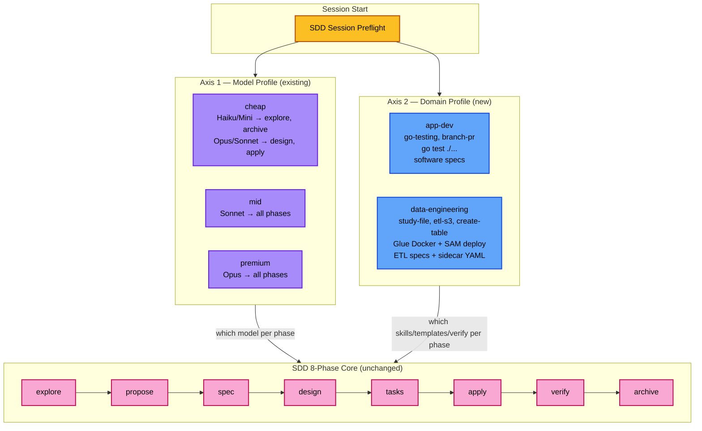
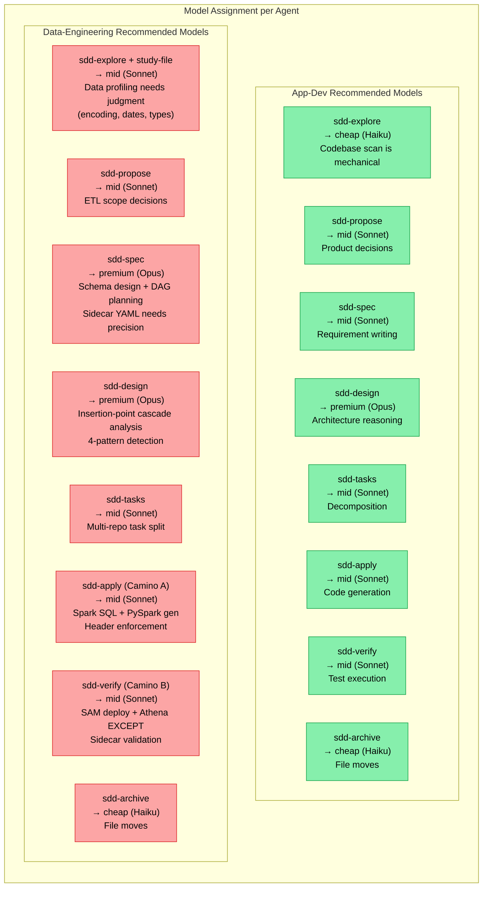
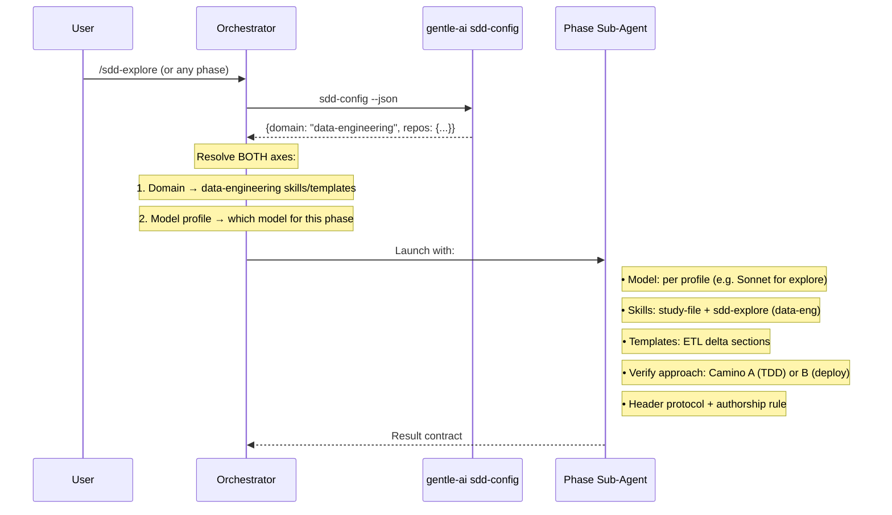

# SDD Profiles: Domain × Model

← [Back to README](../README.md)

---

## Two Orthogonal Axes

SDD has **two independent profile axes** that combine to determine how each phase executes:

| Axis | Question | Existing? | Config Location |
|------|----------|-----------|-----------------|
| **Model Profile** | Which AI model runs each phase? | ✅ Yes (`sdd-profiles`) | `opencode.json` agent overlays, TUI model picker |
| **Domain Profile** | Which domain rules/skills/templates apply? | ✅ New (`data-engineering-domain`) | `openspec/config.yaml` `domain:` field |

They are independent — a project can be `domain: data-engineering` with a `cheap` model profile, or `domain: app-dev` with a `premium` profile. Both axes are resolved at session start and applied to every phase.

---

## Architecture Diagram



---

## Domain Profile Comparison

```mermaid
flowchart LR
    subgraph APP_DEV["App-Dev Profile (default)"]
        direction TB
        A_EXPLORE["explore<br/>Read codebase<br/>Skill: sdd-explore<br/>Model: per profile"]
        A_SPEC["spec<br/>Software requirements<br/>Given/When/Then (code)<br/>Skill: sdd-spec"]
        A_DESIGN["design<br/>Architecture patterns<br/>Skill: sdd-design"]
        A_TASKS["tasks<br/>Implementation tasks<br/>Skill: sdd-tasks"]
        A_APPLY["apply<br/>Write Go/code<br/>TDD: go test<br/>Skill: sdd-apply + go-testing"]
        A_VERIFY["verify<br/>go test ./...<br/>go vet, go build<br/>Skill: sdd-verify"]

        A_EXPLORE --> A_SPEC --> A_DESIGN --> A_TASKS --> A_APPLY --> A_VERIFY
    end

    subgraph DATA_ENG["Data-Engineering Profile (new)"]
        direction TB
        D_EXPLORE["explore<br/>Study source data (CSV, tables)<br/>Skill: study-file + sdd-explore<br/>ETL delta sections"]
        D_SPEC["spec<br/>ETL requirements<br/>Source → Transform → Dest<br/>Sidecar YAML: schema, partitions<br/>Watermark strategy"]
        D_DESIGN["design<br/>DAG of transformations<br/>Insertion-point analysis<br/>Pattern-aware (4 patterns)"]
        D_TASKS["tasks<br/>[infra] / [carga] / [both] prefix<br/>Git flow: Bitbucket feature→develop→release"]
        D_APPLY["apply (Camino A)<br/>Glue Docker TDD loop<br/>Header protocol enforcement<br/>Authorship: human name"]
        D_VERIFY["verify (Camino B)<br/>SAM deploy both repos<br/>Athena EXCEPT dev vs prd<br/>Sidecar validation<br/>Profile scrubbing"]
        D_ARCHIVE["archive<br/>Same as app-dev"]

        D_EXPLORE --> D_SPEC --> D_DESIGN --> D_TASKS --> D_APPLY --> D_VERIFY --> D_ARCHIVE
    end

    classDef appPhase fill:#86efac,stroke:#16a34a,stroke-width:2px,color:#000
    classDef dataPhase fill:#fca5a5,stroke:#dc2626,stroke-width:2px,color:#000

    class A_EXPLORE,A_SPEC,A_DESIGN,A_TASKS,A_APPLY,A_VERIFY appPhase
    class D_EXPLORE,D_SPEC,D_DESIGN,D_TASKS,D_APPLY,D_VERIFY,D_ARCHIVE dataPhase
```



---

## Per-Agent Model Assignment

Each SDD phase runs as a sub-agent. The model assigned to each sub-agent can vary by domain — data-engineering phases may benefit from different model tiers than app-dev phases.



### Why data-engineering needs different model tiers

| Phase | App-Dev (why cheap is OK) | Data-Eng (why it changes) |
|-------|---------------------------|---------------------------|
| **explore** | Codebase scan = mechanical | Data profiling = judgment (encoding, DD/MM vs MM/DD, types) |
| **spec** | Requirements = straightforward | Schema + DAG + sidecar = precision critical |
| **design** | Architecture patterns = well-known | Insertion-point cascade = complex dependency analysis |
| **apply** | Code gen from tests = clear | Spark SQL translation (Presto→Spark) + header protocol = nuanced |
| **verify** | `go test` = binary pass/fail | Athena EXCEPT + sidecar validation = interpretation needed |

---

## How Model + Domain Combine at Runtime



---

## Config: How Both Profiles Are Declared

### Model Profile (existing — in opencode.json)

```json
{
  "agent": {
    "sdd-orchestrator": { "model": "anthropic/claude-sonnet-4-20250514" },
    "sdd-explore": { "model": "anthropic/claude-haiku-4-5-20250315" },
    "sdd-design": { "model": "anthropic/claude-opus-4-20250514" },
    "sdd-apply": { "model": "anthropic/claude-sonnet-4-20250514" }
  }
}
```

### Domain Profile (new — in openspec/config.yaml)

```yaml
domain: data-engineering
repos:
  infra: ./repositorios/infra-datos-trs-posventa
  carga: ./repositorios/carga-datos-trs-posventa
aws_profiles:
  prd: AWSReadFullDat-874970050509
  dev: aws-tcl-ope-set-cloud-895593169121
  usuario: aws-tcl-ope-set-devdat-516363283643
verify:
  skip_deploy: false
```

### Combined resolution

```
Phase: sdd-explore
  Model:  opencode.json → claude-haiku-4-5 (from model profile)
  Domain: config.yaml → data-engineering (from domain profile)
  Result: Haiku runs sdd-explore WITH study-file skill + ETL delta sections
```

---

## See Also

- [SDD Ecosystem](sdd-ecosystem.md) — full ecosystem diagram with skills, MCP, Engram
- [OpenSpec Config](openspec-config.md) — domain profile config fields
- [OpenCode Profiles](opencode-profiles.md) — model profile configuration
- [Skill Registry](skill-registry.md) — how skills are resolved per domain
